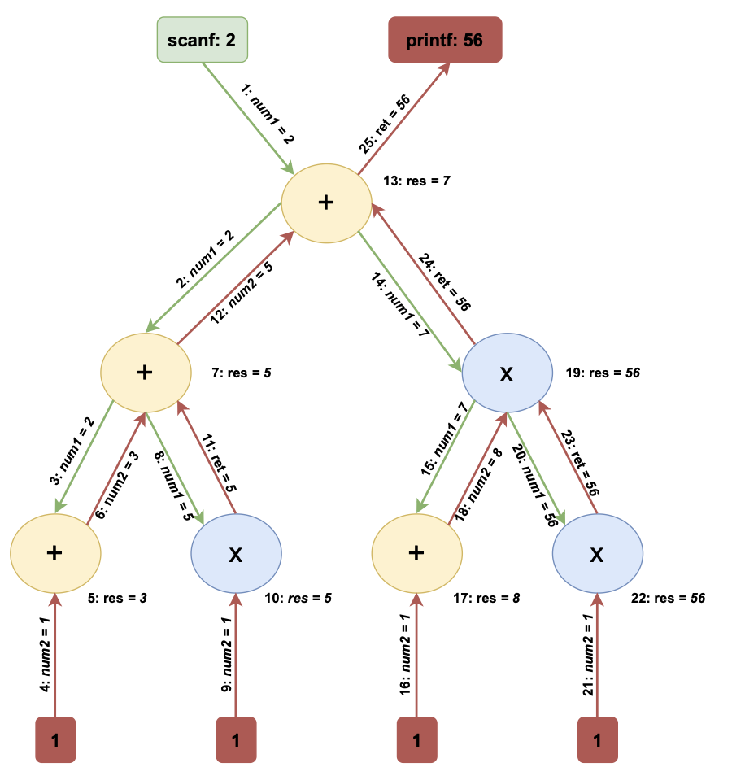

# TreePipe Command

## Overview

This project simulates the `TreePipe` command, a process-based shell command that constructs and executes a binary tree of processes. Each node in this tree executes one of two external programs, `./left` or `./right`, and communicates with its parent and children using Unix pipes. The root node interacts with the user, taking inputs and displaying the final result.

The execution mimics **in-order traversal** of a binary tree, ensuring proper sequencing of processes. This simulation demonstrates inter-process communication using Unix system calls like `fork`, `pipe`, and `execvp`.

---

## Description



The `TreePipe` command operates as follows:

- **Tree Structure**: Creates a full binary tree of processes. Each node represents a process.
- **Execution**: 
  - **Left Child**: Executes the program `left`, which computes the sum of two integers for this example, but can be any operation that takes two integers as input from standard input.
  - **Right Child**: Executes the program `right`.

- **Communication**: Processes pass values (`num1` and `num2`) between parents and children through pipes, enabling dynamic computation.

- **Root Behavior**: The root node reads its input from the user via `scanf` and displays the final result using `printf`.

---

## Key Features

## Project Files
- **`treePipe.c`**: Main implementation of the `TreePipe` command.
- **`p.c`**: Helper program to generate child processes. 

---

## How to Use
### Compilation
Compile the programs using the following commands:

```bash
gcc -o treePipe treePipe.c
gcc -o left p.c
gcc -o right p.c
```

### Execution

Run the `treePipe` command with the following arguments:
```bash
./treePipe <current depth> <max depth> <left(0) or right(1)>
```

### Example
For a tree with depth 2:
```bash
./treePipe 0 2 0
```

Expected input and output:
1. The root asks the user for `num1`.
2. The program computes the result through the binary tree and prints it.

---

## Few Implementation Details
1. **System Calls**:
   - `fork`: Creates child processes.
   - `pipe`: Enables communication between parent and child processes.
   - `execvp`: Executes external programs (`left` and `right`).
   - `dup2`: Redirects file descriptors for I/O operations.
2. **Data Flow**:
   - `num1` flows from parent to child.
   - Results (`num2`) flow back from child to parent.
3. **Default Values**:
   - Leaf nodes have `num2 = 1` by default.
